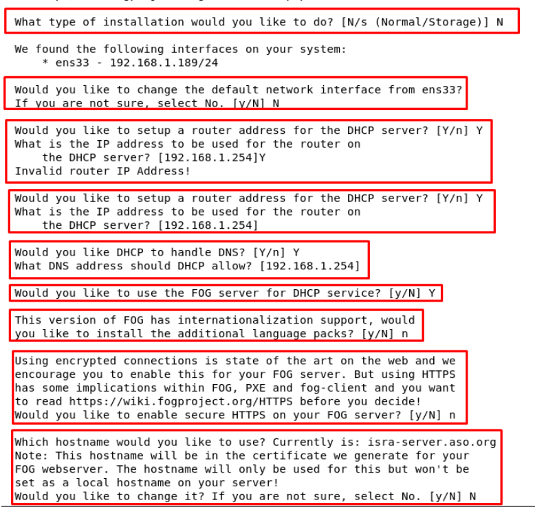
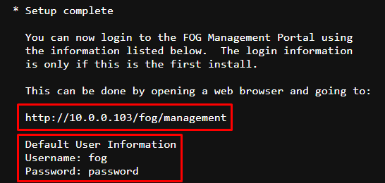

# FOGProject 

## Introducción

FOG Project es una plataforma de imagen y despliegue de sistemas operativos de código abierto que permite a los administradores de sistemas crear y desplegar imágenes de sistemas operativos en una red de computadoras. FOG Project utiliza un servidor central para almacenar y distribuir imágenes, y permite a los administradores realizar tareas como clonación de discos duros, despliegue de imágenes en múltiples computadoras, control de inventario y monitoreo de la red. 

## Instalar la última versión de desarrollo
## Ubuntu 22.04 & Debian 11.6

0. Instala y actualiza tu distribución de servidor Linux
```
sudo apt update -y && sudo apt upgrade -y
```
1. Muevase a 
```
cd /opt/
```
2. Descargue los archivos de instalación

* Todo lo que se necesita para comenzar la instalación es descargar los archivos para realizar la instalación.

  **git** 
  ```
  git clone https://github.com/itsisrael/fogproject.git
  ```

2. Ejecute el script de instalación **como root** y siga todas las indicaciones correspondientes

```
sudo -i
cd /opt/fogproyect-dev/bin/
./installfog.sh
```

3. Pasos del instalador ***(resumen)***
   
**Versión del instalador**
El instalador intenta adivinar la distribución que está ejecutando. Elija la opción apropiada.
***Opción 2***



3.1. Pasos del instalador explicados 


**Modo de instalación**  
Con el mismo instalador puede instalar un servidor Fog normal o un nodo Fog Storage. Para obtener una explicación de un nodo de almacenamiento y cómo instalar un nodo de almacenamiento, consulte todo: instalar el nodo de almacenamiento .

Como estamos instalando un FOG Server, elija **N** aquí.

**Interfaz de red predeterminada**  
El instalador necesita saber qué interfaz de red se utilizará para la conexión de red. Si el instalador adivinó la interfaz correcta, elija **N**

De lo contrario, elija y y escriba el nombre de la interfaz de red (como eth0, ens192).

**Servidor DHCP**  
Tiene la opción de ejecutar un servidor DHCP en el servidor FOG. Si ya tiene un servidor DHCP en su red, puede responder **N** a las siguientes preguntas. Para obtener más información sobre cómo configurar un servidor DHCP existente para que funcione con FOG, consulte Otro servidor DHCP que no sea FOG .


**Dirección del enrutador DHCP**  
Si va a ejecutar un servidor DHCP en este servidor Fog, escriba **Y** y escriba la dirección del enrutador (o puerta de enlace predeterminada) que anunciará el servidor DHCP.

Si ya tiene un servidor DHCP existente en su red, elija **N** aquí.

**DHCP manejar DNS**  
Si va a ejecutar un servidor DHCP en este servidor Fog, escriba **Y** si desea que el servidor DHCP anuncie servidores DNS. Además, escriba la dirección IP del servidor DNS.

Si ya tiene un servidor DHCP existente en su red, elija **N** aquí.

**Ejecutar servidor DHCP**  
Si va a ejecutar un servidor DHCP en este servidor Fog, elija **Y**. De lo contrario, elija **N**.

**Apoyo a la internacionalización**  
Si desea que la interfaz de usuario de Fog Web proporcione idiomas adicionales, elija S aquí.

**Soporte HTTPS**  
Incluso sin compatibilidad con HTTPS, los clientes y el servidor FOG utilizan un canal seguro para comunicarse. La configuración de la compatibilidad con HTTPS requiere que se tomen algunos pasos adicionales.

*Para una instalación de servidor estándar, responda **N** aquí.*

**Nombre de host**  
Compruebe y corrija el nombre de host. Este nombre de host se utiliza para configurar la interfaz de usuario de Fog Web. Elija **N** para aceptar el nombre de host sugerido; de lo contrario, elija **Y** e ingrese el nombre de host correcto.

**Resumen**  
El instalador muestra todas las opciones. Si está seguro de que todo es correcto, elija **Y**. Si elige **N**, el instalador se detendrá y tendrá que reiniciar el proceso de instalación.  

**Si la instalación se completa correctamente obtendra este OUTPUT**



### LINKS  
- [FOG Documentation](https://docs.fogproject.org/en/latest/index.html)
- [FOG Installer Dashboard](https://fogtesting.fogproject.us/)
